# Rapport du laboratoire 4

Github : https://github.com/SunnyKentz/labo-4-log430.git

## Préambule

Dans le cadre du laboratoire 4, j'ai ajouté deux nouvelles dépendances à mon architecture : Grafana et Prometheus.
Ces deux dépendances augmentent l'observabilité de mon application.
Sur Grafana, je surveille les 4 Golden Signals.

## Test de charge initial et observabilité de base

#### Outils choisis : 
J'ai créé mon propre outil sous `tests/loadtests/test.js`. Cet outil me permet d'envoyer des requêtes fetch selon le nombre de requêtes par seconde mis en argument. Je fais ces trois requêtes :
- Consultation simultanée des stocks de plusieurs magasins.
- Génération de rapports consolidés.
- Mise à jour de produits à forte fréquence.

#### Résultats :
Mon application fonctionne bien à 1 RPS (requête par seconde) mais tombe en défaillance à 30 RPS. Le nombre de requêtes sur le service logistique est considérablement plus élevé que les autres à cause des rapports consolidés.

### ici on peut voir que le système est stable à 1rps
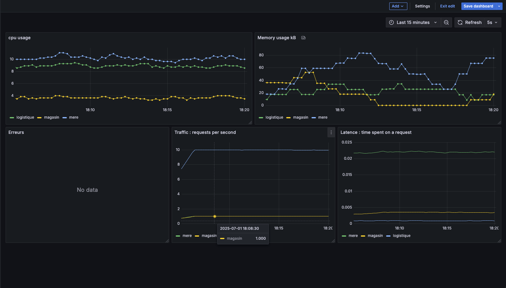

### le service logistique tombe en premier en retournant des erreurs de la base de données à 30rps
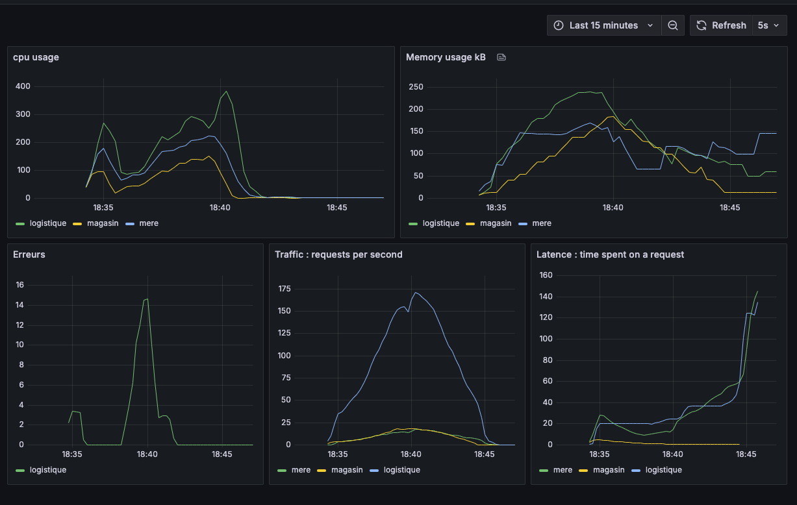

### ensuite à 100rps je perds la connexion ssh et la base de données mère tombe
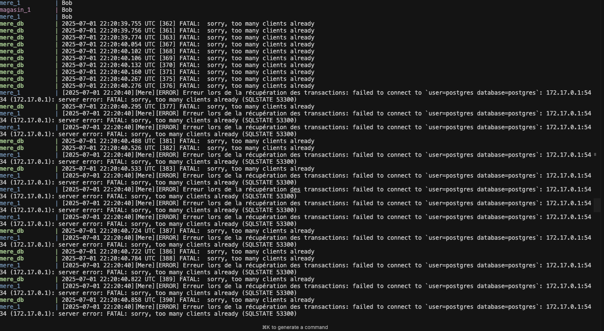

#### Analysez les points faibles de l’architecture:

1. il y a trop d'appels vers le service logistique, il faut donc cacher les réponses du service
2. il faut aussi cacher les résultats de la base de données lors du listing des produits dans les magasins.
3. il faut aussi cacher les résultats de la db quand on liste les transactions pour la base de données mère

## Ajout d’un Load Balancer et résilience

J'ai décidé d'utiliser Traefik pour mon load balancing car, traefik est plus récent et est construit avec go et se configure sur docker-compose facilement. et l'orchestration via Docker Compose.

### Analyse par nombre d'instance :
Je décide de scale avec un nombre N le service de logistique car ce service est celui qui reçoit le plus de requêtes
Dans ces tests je perds la connexion ssh à 30 rps

#### N = 1 instance

| RPS = 1 | RPS = 15 | RPS = 30 |
|---------|----------|----------|
| 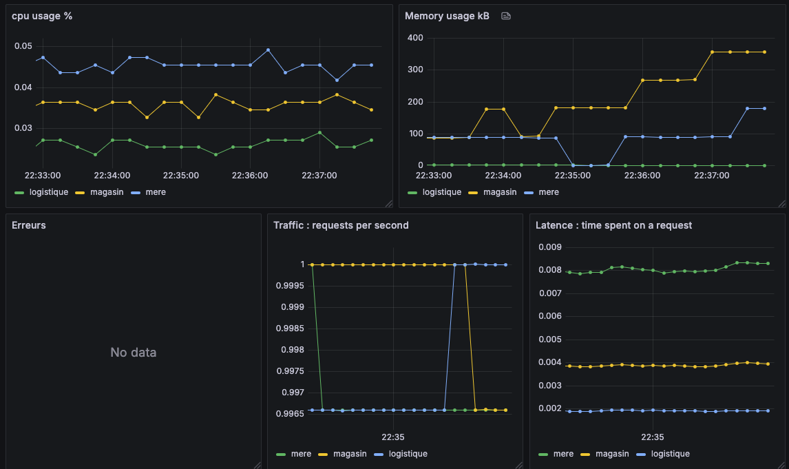 | 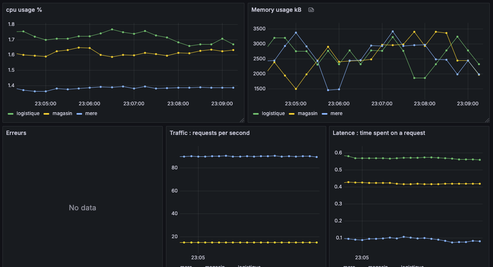 | 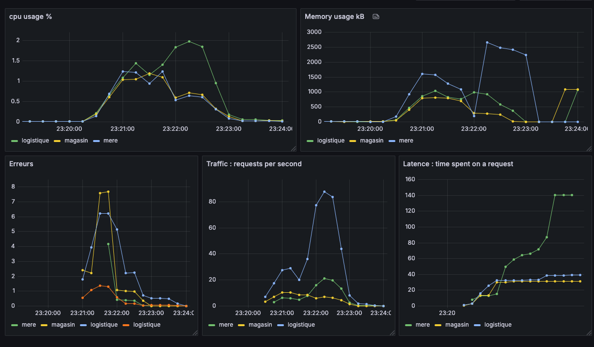 |

#### N = 2 instances

| RPS = 1 | RPS = 15 | RPS = 30 |
|---------|----------|----------|
| 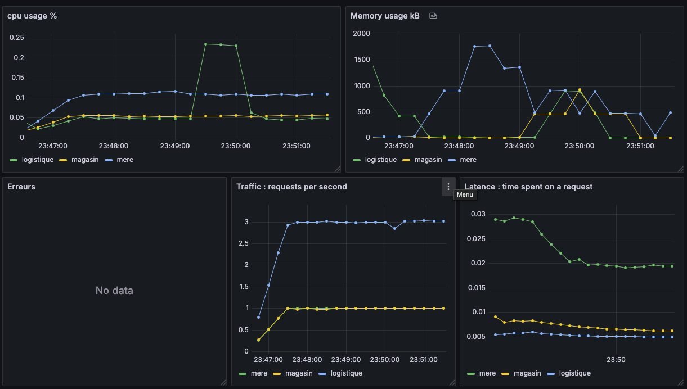 | 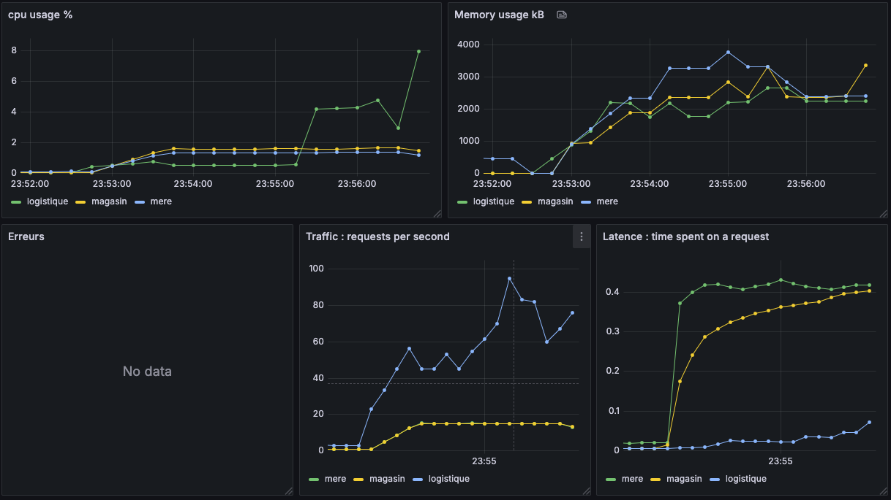 | 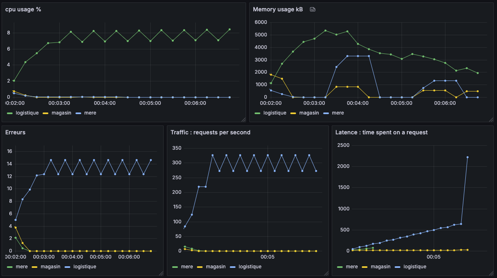 |

#### N = 3 instances

| RPS = 1 | RPS = 15 | RPS = 30 |
|---------|----------|----------|
| 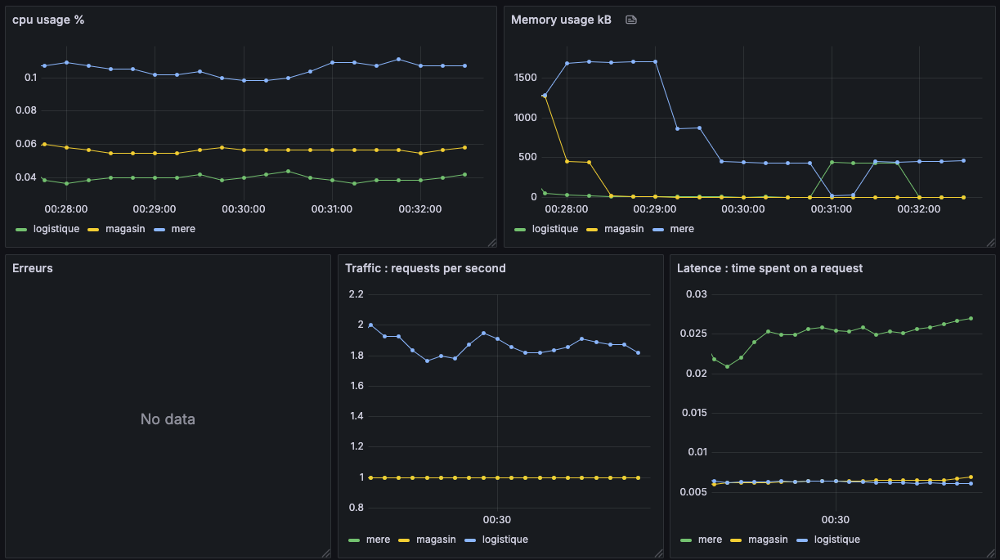 | 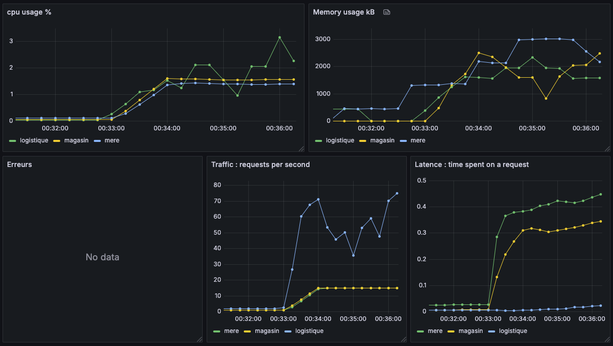 | 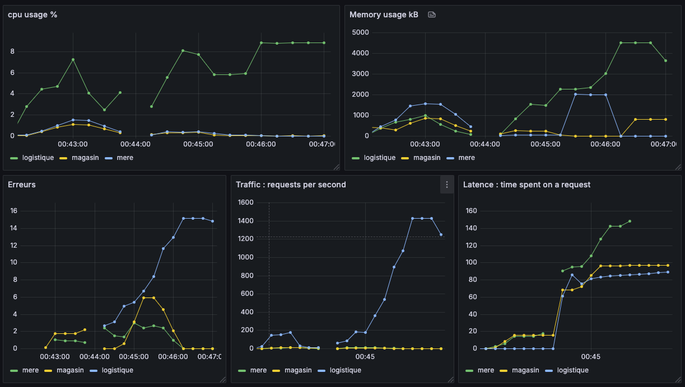 |

#### N = 4 instances

| RPS = 1 | RPS = 15 | RPS = 30 |
|---------|----------|----------|
| 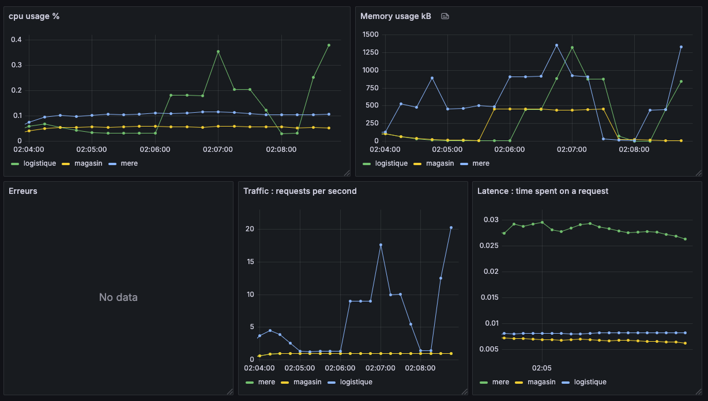 | 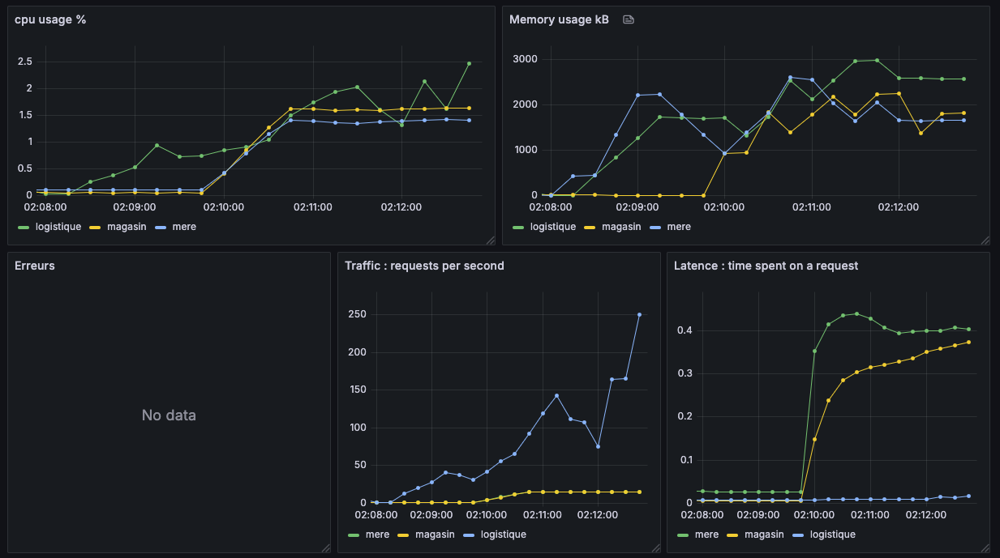 | 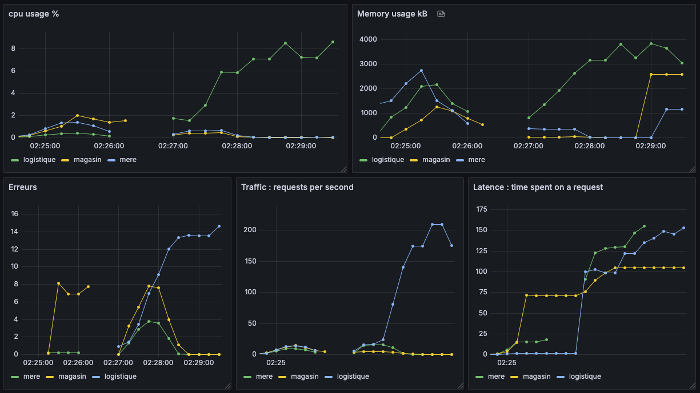 |

### Présentez un graphique comparatif

Nous pouvons voir ici que le nombre de temps passé sur une requête diminue de peu grâce au scale de nombre d'instance.  
Mais pas de beaucoup car le véritable ralentissement vient des demandes de lecture et d'écriture à la base de données.

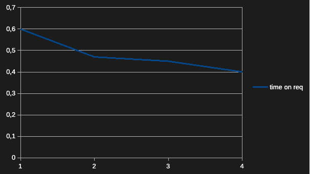

### Test de tolérance aux pannes

ce test a été fait avec 19 requêtes par seconde et 2 instances 

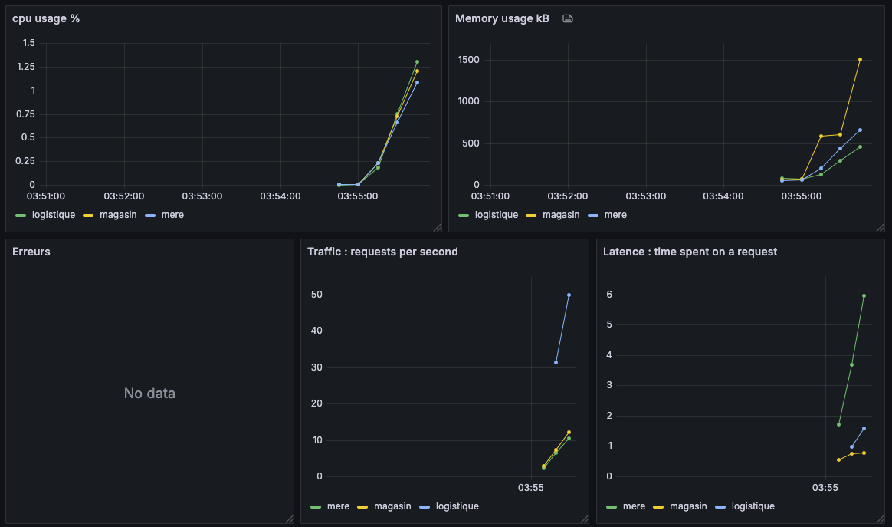

ce test a été fait avec 19 requêtes par seconde scaled down à 1 instance

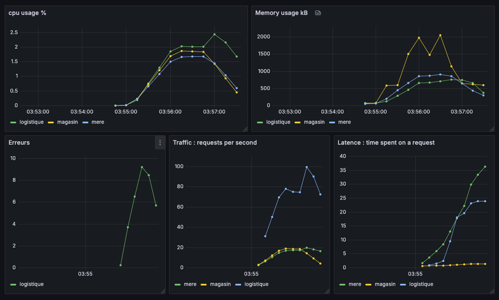

On peut voir que le nombre d'erreurs a augmenté en réduisant le nombre d'instances.
Le Service a continué normalement mais avec des erreurs.
Le load balancer a redirigé tout le trafic vers la seule instance qui restait

### Analyse des stratégies de load balancing

Traefik supporte les algorithmes Round Robin, Least Connections et Weighted Round Robin, mais mon cpu et ram sont trop faibles pour pouvoir déduire une conclusion en ce qui concerne la différence entre les algorithmes.
il faudrait que je puisse au moins arriver à 500 req/s

### Documentez les limites observées malgré la répartition de charge.

La répartition de charge peut en effet rendre l'application disponible plus vite mais si les requêtes vers la base de données prennent du temps et qu'il n'y a qu'une seule base de données. le problème de latence ne s'arrange pas.
En effet dans mes observations le service de logistique tombe en panne en premier car c'est ce service qui fait le plus de lecture et d'écriture vers la base de données.

## Implémentation d’un cache sur des endpoints critiques

#### Identifiez les endpoints les plus sollicités
 - GET http://localhost/mere/api/v1/raport
 - PUT http://localhost/mere/api/v1/produit
 - GET http://localhost/magasin/api/v1/produits

 #### Ajoutez un mécanisme de cache 

 J'ai ajouté un middleware qui regarde un hashmap et le temps que ça a été set pour retourner de bonheur la requête:

 `cache["api/v1/raport"] = JSON{...}`
 `cache["time - api/v1/raport"] = time.Now()`
 Je set le hashmap à chaque API_Success

#### Configurez les règles d’expiration et d’invalidation: 

Je valide le cache tant que c'est à l'intérieur de 30 sec

`time.Now() - cache["time - api/v1/raport"] > 30 sec`

#### Répétez les tests de charge et comparez les performances :
- Réduction de la latence des endpoints mis en cache ?
    - Il y a une grande réduction de la latence. nous pouvons même atteindre 100 req/s avec le cache.
- Diminution de la charge sur la base de données ?
    - Essentiellement, avec un cache de 30 secondes la base de données est sollicitée 2 fois par seconde. ce qui est un développement pour la latence
- Évolution de la saturation ? 
    - on peut voir que le niveau d'utilisation de mémoire ram a augmenté à cause du cache

#### Consignez les gains observés et toute limitation
- la limitation principale est que les changements dans les bases de données ne se voient que après 30 secondes.